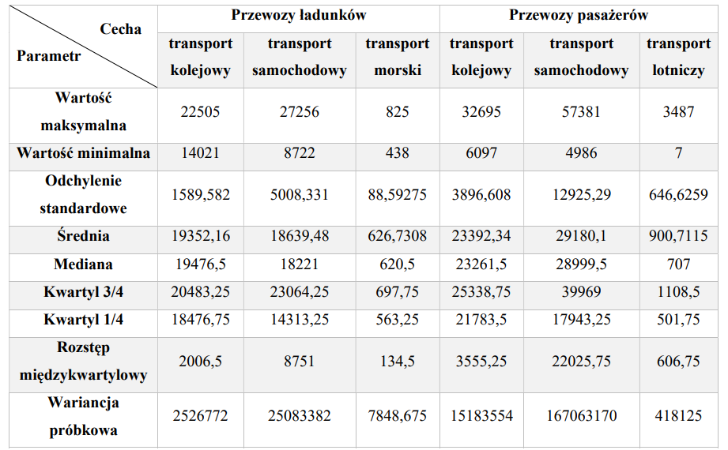
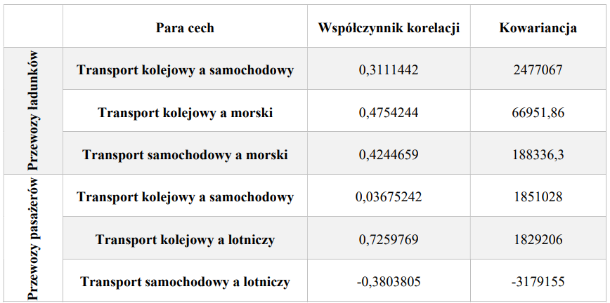

# Struktura transportu i jej zmiany w Polsce w latach 2010 - 2022

## Spis treści

1. [Wstęp](#1-wstęp)
2. [Opis użytych danych](#2-opis-użytych-danych)
3. [Wczytanie danych do środowiska R](#3-wczytanie-danych-do-środowiska-r)
4. [Wyznaczanie podstawowych parametrów opisowych](#4-wyznaczanie-podstawowych-parametrów-opisowych)
5. [Graficzna prezentacja danych](#5-graficzna-prezentacja-danych)
6. [Weryfikacja hipotez statystycznych](#6-weryfikacja-hipotez-statystycznych)
7. [Literatura](#literatura)


## 1. Wstęp
Celem tego projektu jest przeprowadzenie analitycznej oceny struktury transportu w Polsce w okresie lat 2010-2022, z uwzględnieniem dwóch głównych kategorii: przewozów ładunków i przewozów pasażerów. Projekt ten skupi się na analizie zmian w poszczególnych sektorach transportu, takich jak transport drogowy, kolejowy, morski w kontekście przewozów ładunków, oraz transport drogowy, kolejowy i lotniczy w odniesieniu do przewozów pasażerów. Projekt ten pozwoli zidentyfikować, czy przewozy ładunków i pasażerów w Polsce zmieniły się w badanym okresie, czy też pozostały na stałym poziomie, a może nawet się zmniejszyły.

## 2. Opis użytych danych
W projekcie zostały użyte dane o przewozach ładunków i pasażerów w Polsce. Dane pochodzą z biuletynu statystycznego GUS: [link do danych](https://stat.gov.pl). Dane w tabeli podane są w tysiącach ton. Przewozy ładunków odnoszą się do sumy masy ładunków, a przewozy pasażerów obejmują sumę pasażerów przewiezionych różnymi środkami transportu. Dzięki tym danym będziemy w stanie analizować i oceniać zmiany w strukturze transportu w Polsce w badanym okresie.

## 3. Wczytanie danych do środowiska R

#### 3.1. Instalowanie i ładowanie bibliotek

```R
library(RColorBrewer)
library(tseries)
library(openxlsx)
library(dplyr)
library(plotly)
library(plotrix)
library(ggplot2)
library(stringr)
library(reshape2)
library(scales)
```

Opis wykorzystanych bibliotek:

1. **openxlsx**: Biblioteka do obsługi plików Excel. Umożliwia odczyt, zapis i manipulacje danymi w formacie xlsx.

2. **dplyr**: Narzędzie do manipulacji danymi w języku R. Posiada funkcje do wykonywania popularnych operacji takich jak filtrowanie, sortowanie, grupowanie, łączenie i wiele innych, ułatwiając pracę z danymi.

3. **plotly**: Biblioteka do tworzenia interaktywnych wykresów i wizualizacji danych. Pozwala na generowanie interaktywnych wykresów, które można przeglądać, zoomować czy też eksportować.

4. **plotrix**: Biblioteka zawiera funkcje do tworzenia różnych typów wykresów w R, takich jak wykresy kołowe, histogramy, wykresy słupkowe itp. Wspiera różne opcje dostosowania wykresów.

5. **ggplot2**: Narzędzie do tworzenia wykresów, które opiera się na "grammar of graphics" (gramatyka grafiki). Pozwala na tworzenie estetycznych i elastycznych wykresów poprzez definiowanie warstw, estetyki, skali itp.

6. **stringr**: Pakiet do obsługi operacji na ciągach znaków w R. Zapewnia wiele przydatnych funkcji do manipulacji i analizy tekstu.

7. **reshape2**: Biblioteka do przekształcania i restrukturyzacji danych w R. Pomaga w przekształcaniu danych między różnymi formatami, co ułatwia analizę.

8. **scales**: Pakiet do obsługi skal, etykiet i przekształceń wizualnych w R. Zapewnia funkcje ułatwiające dostosowywanie skal i etykiet w wykresach.
#### 3.2. Wczytywanie danych z Excela

Za pomocą funkcji `read.xlsx` został wczytany plik z danymi, dodatkowo zostało określone z której zakładki oraz od którego wiersza chcemy wczytać dane.

```R
dane <- read.xlsx("Plik_z_danymi_źródłowymi.xlsx", sheet = 1, startRow = 6)
```
#### 3.3. Przygotowanie danych do dalszego przetwarzania

Aby wczytane dane były czytelne, tworzymy wektor z nazwami, które później przypisujemy do odpowiednich kolumn.

```R
kolumny <- c("Okres", "ogolem - przewozy ladunkow", "transport kolejowy - ladunki", 
              "transport samochodowy - ladunki", "transport morski - ladunki", 
              "ogolem - przewozy pasazerow", "transport kolejowy - pasazerowie", 
              "transport samochodowy - pasazerowie", "transport lotniczy - pasazerowie")
colnames(dane) <- kolumny
```
## 4. Wyznaczanie podstawowych parametrów
Wyznaczanie podstawowych parametrów opisowych dla przewozów ładunków i pasażerów pozwoli nam lepiej zrozumieć charakterystykę danych oraz różnice między poszczególnymi rodzajami transportu.

### Podstawowe parametry dla przewozów ładunków i pasażerów:
- **Wartość maksymalna**: Użyto funkcji `max()` do znalezienia największej wartości w danych dla każdego rodzaju transportu.
- **Wartość minimalna**: Zastosowano funkcję `min()` do znalezienia najmniejszej wartości dla każdego rodzaju transportu.
- **Odchylenie standardowe**: Wykorzystano funkcję `sd()` do obliczenia odchylenia standardowego, miary zmienności danych.
- **Średnia**: Przeliczono średnią arytmetyczną za pomocą funkcji `mean()`.
- **Mediana**: Obliczono medianę, czyli środkową wartość w posortowanym zestawie danych, korzystając z funkcji `median()`.
- **Kwartyle**: Użyto funkcji `quantile()` do obliczenia pierwszego i trzeciego kwartyla, co pozwala na analizę rozkładu wartości w danych.
- **Rozstęp międzykwartylowy**: Zastosowano funkcję `IQR()` do obliczenia różnicy między trzecim a pierwszym kwartylem, co pomaga w analizie rozproszenia wartości.
- **Wariancja**: Obliczono wariancję próbkową za pomocą funkcji `var()`, która jest miarą rozproszenia danych.
- **Współczynnik korelacji**: Wykorzystano funkcję `cor()` do obliczenia współczynnika korelacji między danymi dla różnych rodzajów transportu.
- **Kowariancja**: Zastosowano funkcję `cov()` do obliczenia kowariancji między zestawami danych, co jest miarą współzmienności między nimi.


#### Wszystkie te obliczenia pomagają w lepszym zrozumieniu charakterystyki danych i różnic między rodzajami transportu.

### 4.1 Podsumowanie podstawowych parametrów opisowych 


*Tabela 1 Podsumowanie podstawowych parametrów opisowych cz.1*


*Tabela 2 Podsumowanie podstawowych parametrów opisowych cz.2*


#### Podsumowanie wyników dotyczących struktury transportu w Polsce

##### Przewozy ładunków:
- Maksymalna wartość przewozów ładunków: Najwyższą wartość zanotowano w transporcie samochodowym (27,256).
- Minimalna wartość przewozów ładunków: Najniższą wartość zanotowano w transporcie morskim (438).
- Średnia wartość przewozów ładunków: Najwyższą średnią zanotowano w transporcie kolejowym (19,352.16).
- Mediana przewozów ładunków: Najwyższą medianę zanotowano w transporcie kolejowym (19,476.5).
- Odchylenie standardowe przewozów ładunków: Najwyższe odchylenie standardowe zanotowano w transporcie samochodowym (5,008.331).
- Wariancja przewozów ładunków: Najwyższą wariancję zanotowano w transporcie samochodowym (25,083,382).
- Kwartyl 1/4 przewozów ładunków: Najwyższy kwartyl 1/4 zanotowano w transporcie kolejowym (18,476.75).
- Kwartyl 3/4 przewozów ładunków: Najwyższy kwartyl 3/4 zanotowano w transporcie samochodowym (23,064.25).
- Rozstęp przewozów ładunków: Najwyższy rozstęp zanotowano w transporcie samochodowym (18,534).
- Rozstęp międzykwartylowy przewozów ładunków: Najwyższy rozstęp międzykwartylowy zanotowano w transporcie samochodowym (8,751).

##### Przewozy pasażerów:
- Maksymalna wartość przewozów pasażerów: Najwyższą wartość zanotowano w transporcie samochodowym (57,381).
- Minimalna wartość przewozów pasażerów: Najniższą wartość zanotowano w transporcie lotniczym (7).
- Średnia wartość przewozów pasażerów: Najwyższą średnią zanotowano w transporcie samochodowym (29,180.1).
- Mediana przewozów pasażerów: Najwyższą medianę zanotowano w transporcie samochodowym (28,999.5).
- Odchylenie standardowe przewozów pasażerów: Najwyższe odchylenie standardowe zanotowano w transporcie samochodowym (12,925.29).
- Wariancja przewozów pasażerów: Najwyższą wariancję zanotowano w transporcie samochodowym (167,063,170).
- Kwartyl 1/4 przewozów pasażerów: Najwyższy kwartyl 1/4 zanotowano w transporcie samochodowym (17,943.25).
- Kwartyl 3/4 przewozów pasażerów: Najwyższy kwartyl 3/4 zanotowano w transporcie samochodowym (39,969).
- Rozstęp przewozów pasażerów: Najwyższy rozstęp zanotowano w transporcie samochodowym (52,395).
- Rozstęp międzykwartylowy przewozów pasażerów: Najwyższy rozstęp międzykwartylowy zanotowano w transporcie samochodowym (22,025.75).

##### Współczynniki korelacji i kowariancji dla transportu:
###### Przewozy ładunków:
- Korelacja między transportem kolejowym a samochodowym: Współczynnik korelacji wynosi 0.3111442, a kowariancja wynosi 2,477,067.
- Korelacja między transportem kolejowym a morskim: Współczynnik korelacji wynosi 0.4754244, a kowariancja wynosi 66,951.86.
- Korelacja między transportem samochodowym a morskim: Współczynnik korelacji wynosi 0.4244659, a kowariancja wynosi 188,336.3.

###### Przewozy pasażerów:
- Korelacja między transportem kolejowym a samochodowym: Współczynnik korelacji wynosi 0.03675242, a kowariancja wynosi 1,851,028.
- Korelacja między transportem kolejowym a lotniczym: Współczynnik korelacji wynosi 0.7259769, a kowariancja wynosi 1,829,206.
- Korelacja między transportem samochodowym a lotniczym: Współczynnik korelacji wynosi -0.3803805, a kowariancja wynosi -3,179,155.


### 5. Graficzna prezentacja danych

W tym dziale zostaną przedstawione wyłącznie wybrane wykresy, które najlepiej ilustrują kluczowe aspekty struktury i dynamiki transportu w Polsce. Pozostałe wykresy oraz bardziej szczegółowe analizy dostępne są w załączonym pliku PDF. Przygotowane wizualizacje mają na celu ułatwienie zrozumienia kompleksowych danych dotyczących przewozów ładunków i pasażerów oraz ich relacji z różnymi rodzajami transportu. Dzięki prezentowanym wykresom można szybko zidentyfikować tendencje, porównać udziały poszczególnych sektorów oraz przeanalizować zmiany zachodzące w czasie. Ograniczenie liczby wykresów w tym dokumencie pozwala skupić się na najistotniejszych aspektach analizy, natomiast pełna gama danych i wizualizacji jest dostępna w załączonym pliku PDF.


- **Wykres liniowy prezentujący przewozy ładunków i pasażerów na przestrzeni lat**


```R
# Wykres liniowy, który przedstawia przewozy ładunków i pasażerów w latach 2010-2022

# Tworzenie szeregów czasowych
tr_ladunkow <- ts(dane$`ogolem - przewozy ladunkow`, frequency = 12, start = c(2010, 1))
tr_pasazerow <- ts(dane$`ogolem - przewozy pasazerow`, frequency = 12, start = c(2010, 1))

# Tworzenie wykresu liniowego
plot(tr_pasazerow,
     type = "n",
     main = "Przewozy ładunków i pasażerów w latach 2010-2022",
     xlab = "Rok",
     ylab = "Wartości [tyś.]",
     col = "violet",
     ylim = c(min(tr_ladunkow, tr_pasazerow), max(tr_ladunkow, tr_pasazerow)))

# Dodawanie linii poziomych w tle
abline(h = seq(0, max(tr_pasazerow), by = 5000), col = "lightgray", lty = 2)

# Dodawanie linii pionowych w tle
abline(v = seq(2010, 2022, by = 1), col = "lightgray", lty = 2)

# Rysowanie danych
lines(tr_pasazerow, col = "violet")
lines(tr_ladunkow, col = "blue")

# Legenda
legend(x = "topright", legend = c("Transport pasażerów", "Transport ładunków"),
       col = c("violet", "blue"), lty = 1, cex = 1, lwd = 3)
```

Analiza danych dotyczących przewozu pasażerów wskazuje na tendencję spadkową w ilości przewożonych osób z roku na rok w pewnych okresach. Choć nie ma wyraźnego ciągłego trendu spadkowego przez cały okres analizy, to obserwuje się pewne lata, w których ilość przewożonych pasażerów zmniejszała się w porównaniu z poprzednimi latami. Zwłaszcza w ostatnich latach zanotowano spadki w przewozach, sugerujące tendencję malejącą w ilości przewożonych osób. Ta niestabilność i tendencja spadkowa mogą wynikać z różnych czynników, takich jak zmieniające się preferencje podróżujących, zmiany w warunkach ekonomicznych czy też wpływ zdarzeń zewnętrznych na sektor transportu, które mogły wpłynąć na zmniejszenie ruchu pasażerskiego. Przewozy ładunków w badanym okresie wykazują ogólny trend wzrostowy. Zauważalne są regularne zmiany miesięczne, gdzie niektóre miesiące odznaczają się większymi lub mniejszymi ilościami przewożonych ładunków. Widoczne są okresowe skoki wartości, co może być rezultatem sezonowych trendów, świąt lub wyjątkowych zdarzeń gospodarczych. Pomimo tych wahań, istnieje długoterminowy wzrost w przewozach towarów, co może świadczyć o stabilności lub wzrastającej aktywności w sektorze transportu. Sezonowość również odgrywa istotną rolę, sugerując pewne miesięczne wzorce w przewozach, które mogą być spowodowane cyklicznością w potrzebach przemysłowych lub konsumenckich. Jednak ogólnie rzecz biorąc, trend ten wykazuje tendencję do wzrostu w dłuższym okresie czasu.

- **Histogram przewozów ładunków**

```R
# Tworzenie histogramu dla przewozów ladunkow ogolem
h <- hist(dane$`ogolem - przewozy ladunkow`, 
          col = rgb(0.5, 0.0, 0.5, alpha = 0.5),  # kolor z polprzezroczystoscia 
          main = "Histogram - Przewozy ładunków ogółem",
          xlab = "Wartości", ylab = "Częstość")

# Dodanie etykiet licznosci na szczycie slupkow
text(h$mids, h$counts, labels = h$counts, adj = c(0.5, -0.7))

# Dodanie cienkich linii poziomych
abline(h = seq(0, max(h$counts), by = 10), col = "gray", lwd = 0.5)
```


Analizując histogram, można stwierdzić, że większość danych przewozów ładunków ogółem zawiera się w przedziale między 40000 a 50000. Skrajne wartości (poniżej 35000 i powyżej 55000) występują znacznie rzadziej. To wskazuje na pewne zróżnicowanie w wartościach przewozów, ale też koncentrację w określonym przedziale wartości.

- **Wykres słupkowy przewozów pasażerów w poszczególnych latach z podziałem na rodzaj transportu**

```R
# Grupowanie danych i sumowanie wartości dla każdego roku
dane_suma_pasażerowie <- dane %>%
  mutate(Rok = substr(Okres, 1, 4)) %>%  # Dodanie kolumny z rokiem
  group_by(Rok) %>%
  summarise(
    suma_transport_kolejowy = sum(`transport kolejowy - pasazerowie`),
    suma_transport_samochodowy = sum(`transport samochodowy - pasazerowie`),
    suma_transport_lotniczy = sum(`transport lotniczy - pasazerowie`)
  ) %>%
  ungroup()

# Przekształcenie danych do formatu długiego
dane_suma_pasażerowie_long <- melt(dane_suma_pasażerowie, id.vars = "Rok", variable.name = "Typ_transportu", value.name = "Suma_pasażerow")

# Tworzenie wykresu słupkowego
wykres_suma_pasażerowie <- ggplot(dane_suma_pasażerowie_long, aes(x = Rok, y = Suma_pasażerow, fill = Typ_transportu)) +
  geom_bar(stat = "identity", position = "dodge", width = 0.7, alpha = 0.7) +
  labs(title = "Suma przewozów pasażerów w poszczególnych latach",
       x = "Rok", y = "Suma pasażerów") +
  theme_minimal() +
  theme(axis.text.x = element_text(angle = 45, hjust = 1)) +
  scale_fill_manual(values = c("slateblue1", "lightsteelblue1", "aquamarine"),
                    name = "Typ transportu", 
                    labels = c("Kolejowy", "Samochodowy", "Lotniczy")) +
  scale_y_continuous(labels = scales::comma) +
  theme(legend.title = element_text(hjust = 0.5), 
        plot.title = element_text(hjust = 0.5))

print(wykres_suma_pasażerowie)
```


Wykres przedstawia sumę przewozów pasażerów dla różnych typów transportu na przestrzeni lat. Zauważamy, że transport samochodowy w tych latach zanotował duży spadek. Do roku 2018 zdecydowanie dominował nad innymi typami transportu. Najwyższą wartość odnotował w 2010 roku, gdzie suma przewozów sięgała ponad 550,000. Najniższe wartości zanotował w 2020 oraz w 2021 roku, za to w 2022 roku suma przewozów lekko się zwiększyła. Jeśli chodzi o transport kolejowy zauważamy, że jego wartości na przestrzeni tych lat mieściły się w przedziale 250,000 – 350,000. Najniższą wartość zanotowano w 2020 roku, gdzie zauważamy znaczny spadek w porównaniu do lat poprzednich. Natomiast najwyższą w 2019 oraz 2022 roku. Transport lotniczy jest znacząco niższy od innych typów transportu. Suma przewozów pasażerów transportem lotniczym utrzymywała wartości na podobnym poziomie, pomału wzrastając z roku na rok. W latach 2020 i 2021 zauważamy spadek wartości, w porównaniu do roku 2022, gdzie odnotowujemy najwyższą wartość dla tego typu transportu.

- **Wykres punktowy dla przewozów pasażerów (kolejowy vs samochodowy)**
```R
# Wykres punktowy dla przewozów pasażerów (kolejowy vs samochodowy)
plot(dane$`transport kolejowy - pasazerowie`, 
     dane$`transport samochodowy - pasazerowie`,
     main = "Wykres punktowy - Przewozy pasażerów (kolejowy vs samochodowy)",
     xlab = "Transport kolejowy",
     ylab = "Transport samochodowy",
     col = c("slateblue3", "magenta"), # Dwa różne kolory punktów
     pch = 16, # Kształt punktów (kołka)
     cex = 1) # Rozmiar punktów

# Dodanie siatki
grid()

# Dodanie legendy
legend("topleft", legend = c("Transport kolejowy", "Transport samochodowy"),
       col = c("slateblue3", "magenta"), pch = 16, cex = 0.8)
```


Wykres punktowy, który został przedstawiony, obrazuje związek między dwoma zmiennymi: przewozem pasażerów transportem kolejowym (oś OX) i przewozem pasażerów transportem samochodowym (oś OY). Każdy punkt na wykresie reprezentuje parę wartości: ilość przewiezionych pasażerów danego rodzaju transportu dla danej obserwacji. Analizując wykres, możemy zauważyć, że istnieje pewna zależność między przewozami pasażerów transportem kolejowym a samochodowym. Wartości tych przewozów niekoniecznie rosną lub maleją proporcjonalnie, ale możemy zauważyć, że im więcej pasażerów przewozi się transportem kolejowym, tym zazwyczaj większa jest także liczba pasażerów przewożonych transportem samochodowym.


- **Wykres pudełkowy przewozów ładunków dla transportu kolejowego, samochodowego i morskiego**

```R
# Tworzenie wykresu pudełkowego dla transportu kolejowego, samochodowego i morskiego (przewoz ladunkow)
wp1 <- boxplot(
  dane$`transport kolejowy - ladunki`, 
  dane$`transport morski - ladunki`,
  dane$`transport samochodowy - ladunki`,
  main = "Wykres pudełkowy - Transport ładunków",
  xlab = "Rodzaj transportu",
  ylab = "Ilość ładunków [tyś. ton]",
  col = c("lightcyan4", "lightcyan3", "lightcyan2"),
  names = c("Kolejowy", "Morski", "Samochodowy")
)

# Dodanie parametrów opisowych na wykresie
text(1, wp1$stats[2, 1], labels = sprintf("Q1: %.2f", wp1$stats[2, 1]), pos = 4, offset = 11)
text(1, wp1$stats[3, 1], labels = sprintf("Mediana: %.2f", wp1$stats[3, 1]), pos = 2, offset = -18)
text(1, wp1$stats[4, 1], labels = sprintf("Q3: %.2f", wp1$stats[4, 1]), pos = 2, offset = -16)
text(1, wp1$stats[1, 1], labels = sprintf("Min: %.2f", wp1$stats[1, 1]), pos = 2, offset = -11)
text(1, wp1$stats[5, 1], labels = sprintf("Maks: %.2f", wp1$stats[5, 1]), pos = 2, offset = -12)

text(3, wp1$stats[2, 3], labels = sprintf("Q1: %.2f", wp1$stats[2, 3]), pos = 2, offset = 11)
text(3, wp1$stats[3, 3], labels = sprintf("Mediana: %.2f", wp1$stats[3, 3]), pos = 2, offset = 12)
text(3, wp1$stats[4, 3], labels = sprintf("Q3: %.2f", wp1$stats[4, 3]), pos = 2, offset = 11)
text(3, wp1$stats[1, 3], labels = sprintf("Min: %.2f", wp1$stats[1, 3]), pos = 2, offset = 6)
text(3, wp1$stats[5, 3], labels = sprintf("Maks: %.2f", wp1$stats[5, 3]), pos = 2, offset = 6)

# Dodanie siatki
grid()
```


Wykres pudełkowy umożliwia wizualizację kluczowych cech zbioru danych. Ukazuje medianę (środkową wartość), granice kwartyli: dolny kwartyl (Q1) stanowi 25% danych, a górny kwartyl (Q3) zawiera 75% danych, wąsy wychodzące z pudełka określają zakres wartości, a wartości odstające, znajdujące się poza wąsami, mogą stanowić wartości znacząco różniące się od reszty zbioru danych, będąc potencjalnymi punktami odstającymi.

### 6. Weryfikacja hipotez statystycznych
W tej sekcji przeprowadzono analizę statystyczną w celu weryfikacji hipotez dotyczących przewozu towarów i osób w różnych rodzajach transportu. W statystyce, weryfikacja hipotez polega na testowaniu założeń na podstawie danych, aby ustalić, czy pewne stwierdzenia na temat populacji są prawdziwe czy też nie. Szersza analiza wyników została udokumentowana w pliku PDF.

### Cel Analizy

Celem analizy było zrozumienie i ocena różnic w przewozach towarów i osób między różnymi rodzajami transportu. Istotne różnice w tych dziedzinach mogą mieć znaczący wpływ na zarządzanie logistyką, wybór środków transportu oraz ogólną efektywność systemów transportowych.


 1. **Testowanie różnicy średnich przewozów pasażerów między transportem samochodowym a kolejowym:** 

Do porównywania średnich wartości pomiędzy dwoma grupami możemy użyć 
testu **t-Studenta** dla dwóch niezależnych prób. W tym przypadku, chcemy porównać średnią ilość przewozów pasażerów transportem samochodowym z średnią ilością przewozów 
transportem kolejowym. 

```R
# Testowanie srednich dla przewozow pasazerow transportem samochodowym i kolejowym
wynik_testu <- t.test(dane$`transport samochodowy - pasazerowie`, 
                      dane$`transport kolejowy - pasazerowie`)
# Wyswietlenie wynikow testu
print(wynik_testu)
```

#### Hipotezy:
- **Hipoteza zerowa (H0):** Średnia ilość przewozów pasażerów transportem samochodowym jest równa średniej ilości przewozów transportem kolejowym.
- **Hipoteza alternatywna (H1):** Średnia ilość przewozów pasażerów transportem samochodowym różni się od średniej ilości przewozów transportem kolejowym.
- **Poziom istotności (alfa):** 0,05

#### Wyniki testu:
- Wartość t: 5,3548
- Stopnie swobody (df): 182,94
- Wartość p: 2,548e-07
- Hipoteza alternatywna: Istnieje istotna różnica między średnimi ilościami przewozów pasażerów w obu rodzajach transportu.
- Przedział ufności: 95% przedział ufności dla różnicy średnich wynosi od 3655,218 do 7920,308.
- Estymatory próbkowe: Średnia ilość przewozów pasażerów transportem samochodowym wynosi około 29180,10, a transportem kolejowym około 23392,34. 

Wynik testu wskazuje na istotną statystyczną różnicę między średnimi ilościami 
przewozów pasażerów transportem samochodowym a transportem kolejowym. Otrzymana 
wartość p jest znacząco mniejsza od założonego poziomu istotności alfa = 0.05, co pozwala 
odrzucić hipotezę zerową na rzecz hipotezy alternatywnej, potwierdzając różnicę między 
średnimi ilościami przewozów pasażerów w obu rodzajach transportu. 

2. ###  Test korelacji między przewozem ładunków transportem kolejowym a samochodowym:

Do analizy zależności między ilością przewożonych ładunków transportem kolejowym i samochodowym zastosowano **test korelacji Pearsona**.

```R
# Test korelacji dla przewozow ladunkow (samochodowy - kolejowy)

# korelacja Pearsona
cor_pearson <- cor.test(dane$`transport samochodowy - ladunki`, 
                        dane$`transport kolejowy - ladunki`, method = "pearson")
print("Korelacja Pearsona:")
print(cor_pearson)
```

#### Hipotezy:
- **Hipoteza zerowa (H0):** Brak istotnej korelacji między przewozem ładunków transportem kolejowym a transportem samochodowym.
- **Hipoteza alternatywna (H1):** Istnieje istotna korelacja między przewozem ładunków transportem kolejowym a transportem samochodowym.
- **Poziom istotności (alfa):** 0,05

#### Wynik testu:
- Wartość współczynnika korelacji Pearsona: 0,311
- Wartość p: 7,701e-05

 Wartość współczynnika korelacji Pearsona wskazuje na istnienie umiarkowanej pozytywnej korelacji między ilością przewożonych ładunków transportem kolejowym i samochodowym. Wynik testu jest istotny statystycznie (p < 0,05), co oznacza odrzucenie hipotezy zerowej na rzecz hipotezy alternatywnej. Stwierdzono, że istnieje dodatni związek między ilością przewożonych ładunków transportem kolejowym i samochodowym.

 3. ###  Test normalności rozkładu danych za pomocą testu Shapiro-Wilka dla przewozu ładunków dla transportu kolejowego

Test Shapiro-Wilka jest statystycznym testem używanym do oceny normalności rozkładu danych. Jest to test parametryczny, który pozwala stwierdzić, czy próbka pochodzi z populacji o rozkładzie normalnym.

```R
# Test Shapiro-Wilka dla przewozu ladunkow

#dla danych dotyczacych transportu kolejowego
shapiro_test_kolejowy <- shapiro.test(dane$`transport kolejowy - ladunki`)
print("Test Shapiro-Wilka dla danych transportu kolejowego - pasażerowie:")
print(shapiro_test_kolejowy)
```

#### Hipotezy:
- **Hipoteza zerowa (H0):** Dane pochodzą z populacji o rozkładzie normalnym.
- **Hipoteza alternatywna (H1):** Dane nie pochodzą z populacji o rozkładzie normalnym.
- **Poziom istotności (alfa):** 0,05

#### Wynik testu:
  - Wartość p-value: 0.001931

Wartość p-value wynosząca 0.001931 jest mniejsza niż ustalony poziom istotności 0.05, co oznacza istotną statystycznie różnicę od rozkładu normalnego. Wartość statystyki testowej (W) wynosi 0.97036. Z tego wynika, że należy odrzucić hipotezę o normalności rozkładu danych dotyczących transportu kolejowego.

---
**Szczegółowe wyniki i interpretacje tych testów znajdują się w pliku PDF.**

## Wnioski 📊
Analiza struktury transportu w Polsce w latach 2010-2022 dostarcza głębokiego zrozumienia zmian zachodzących w sektorze transportowym tego kraju. Projekt skupiał się na przewozach ładunków i pasażerów, analizując różnice między poszczególnymi rodzajami transportu, takimi jak transport kolejowy, samochodowy, morski i lotniczy.

Wyniki analizy wskazują na kilka istotnych obserwacji. Po pierwsze, tendencje w przewozach pasażerów wykazują pewną niestabilność, z tendencją spadkową w ostatnich latach. W przeciwieństwie do tego, przewozy ładunków wykazują tendencję wzrostową, choć zauważalne są okresowe fluktuacje, wynikające prawdopodobnie z sezonowych zmian czy zewnętrznych czynników wpływających na gospodarkę.

Wykresy i analizy oparte na danych ilustrują również zróżnicowanie pomiędzy różnymi rodzajami transportu. Transport samochodowy dominował w krajowym przewozie pasażerów przez większość analizowanego okresu, podczas gdy transport kolejowy i lotniczy, mimo niższych wartości, wykazywały pewną stabilność lub delikatny wzrost w przewozach.

Podsumowując, projekt był nie tylko wyzwaniem technicznym, ale także intelektualnym, który pozwolił zgłębić złożoność danych związanych z sektorem transportowym. Praca z językiem R umożliwiła nie tylko skuteczną analizę danych, ale także ich klarowną wizualizację, co było kluczowe dla zrozumienia trendów i wzorców.


